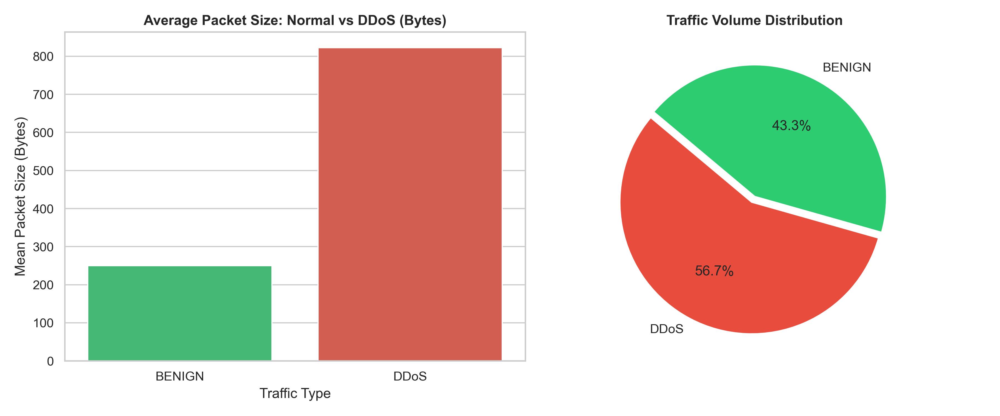

# SOC Threat Intelligence & Network Traffic Analysis

I built this project to analyze network flow anomalies and differentiate DDoS attack patterns from legitimate traffic using the **CICIDS2017** dataset. It combines a local SQLite database, Python for anomaly visualization, and custom DAX measures designed for SOC monitoring dashboards.

## Why This Project?
While studying cybersecurity analytics and threat monitoring, I wanted a hands-on project that moves beyond basic CSV filtering. The goal was simple: take raw packet-level connection logs, structure them efficiently in SQL, and identify the exact metrics (like packet size drops and flow duration spikes) that trigger DDoS alarms in a SOC environment.

## Key Findings & Telemetry
Here is the baseline comparison generated directly from the local SQLite database:



* **Packet Size Anomaly:** Legitimate traffic averages significantly larger payloads, whereas DDoS attacks rely on rapid, small-sized packet flooding to exhaust server resources.
* **Volume Distribution:** Attack traffic creates an overwhelming proportion of short-lived, high-frequency connection flows.

## How It Works
* **Database (`sql/`):** Raw logs are cleaned and ingested into SQLite (`cybersecurity.db`) to simulate connection log indexing.
* **Analysis (`src/visualize.py`):** Queries flow records with Pandas, calculates volume distribution, and plots packet metrics with Seaborn.
* **Power BI & DAX Ready (`docs/`):** Documented analytical DAX formulas (attack ratios, discrepancy indexing) to model these metrics for real-time dashboard reporting.

## How to Run
```bash
# Clone the repository
git clone [https://github.com/EylulNur/ai-cybersec-dashboard.git](https://github.com/EylulNur/ai-cybersec-dashboard.git)
cd ai-cybersec-dashboard

# Run the visualization pipeline
python3 src/visualize.py